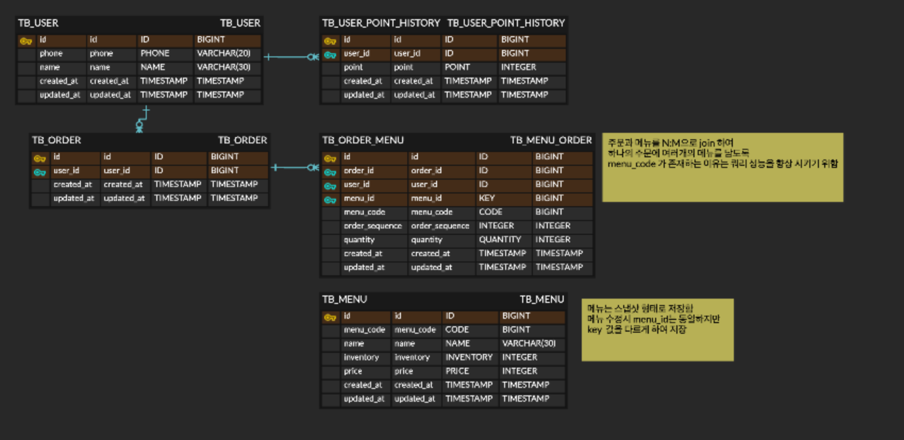

# kakaopay-coffe

## 후기
클린 코드를 지향했다고 했지만, 해당 소스의 아키텍처는 클린하지 못하다.
SI에서 하던대로 작업한것이 많았다.

### 현재 코드의 문제점
1. 코드가 직관적이지 못하다.
2. 욕심을 내서 요구사항 보다 과도한 것이 많다.
3. 결과 리턴에 builder를 많이 사용하였지만,
4. 재고 관리, 포인트 차감과 같은 기능이 Entity에 메서드로 존재해야 객체지향적이라고 할 수 있는데 @service 레이어에 로직이 존재한다.
5. ~Service와 JpaManager, JpaReader가 너무 강하게 결합되어 있다.
6. JpaManager와 JpaReader 또한 Entity와 너무나 강하게 결합되어 있다.

### 그래서 해당 문제점을 고치며 객체지향적이며 클린 아키텍처를 적용한 프로젝트를 다시 시작하였다.
https://github.com/ko-itbuddy/coffee-shop

---

# 테스트 수행시 Docker가 실행 가능한 환경이여야 함. (https://docs.docker.com/engine/install/)

# 활용 기술
- Spring Boot 3.3
- Java 17
- JPA
- MySQL
- Redis
- Test Container
- Kafka (구현 중)

# ERD

# 작업내용
- Entity 작성
- API 설계
- 서비스 로직 개발 (주문/충전/메뉴 조회/인기메뉴 조회)
- 예외 처리 및 API 응답 일관화
- 동시성 이슈 / 데이터 일관성 보장을 고려한 서비스 개발 
  - 동시에 주문, 동시 포인트 충전 등 일관성이 깨지는 현상을 방지하기 위해 Redisson을 활용한 분산 Lock을 활용
- 성능 향상을 위한 캐시 적용
  - 인기메뉴를 조회하는 쿼리의 비용을 줄이기 위한 캐시 활용

# 테스트
- 컨트롤러 테스트
- 서비스 테스트
- @Nested 를 활용하여 각 클래의의 메소드 별로 테스트 구분
