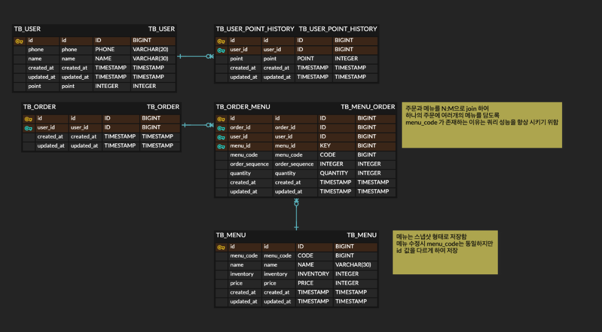

# kakaopay-coffe

# 활용 기술
- Spring Boot 3.3
- Java 17
- JPA
- MySQL
- Redis

# ERD

# 작업내용
- Entity 작성
- API 설계
- 서비스 로직 개발 (주문/충전/메뉴 조회/인기메뉴 조회)
- 예외 처리 및 API 응답 일관화
- 동시성 이슈 / 데이터 일관성 보장을 고려한 서비스 개발
- 동시에 주문이 진행되어 포인트의 일관성이 깨지는 현상을 막기 위하여 Lock을 활용
- 성능 향상을 위한 캐시 적용
  - 인기메뉴를 조회하는 쿼리의 비용을 줄이기 위한 캐시 활용

# 테스트
- 컨트롤러 테스트
- 서비스 테스트

# 주문
- 동시에 10건 이상의 주문